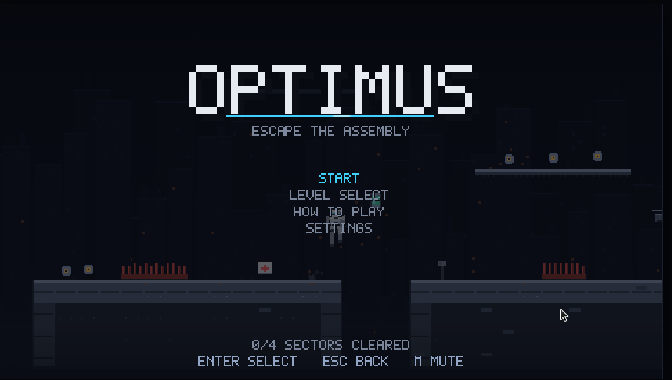
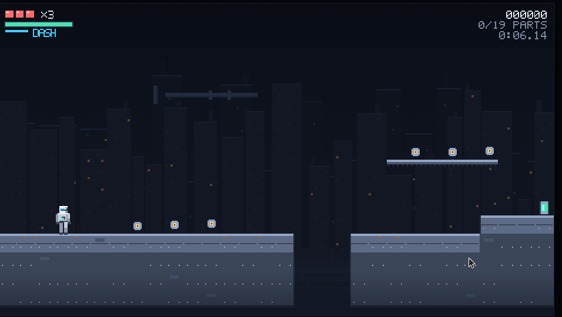
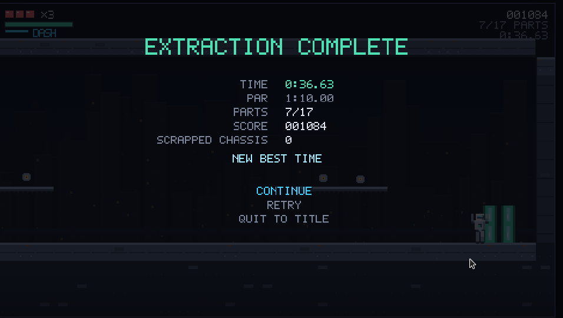
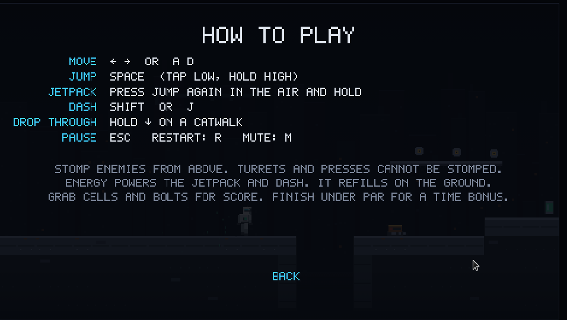
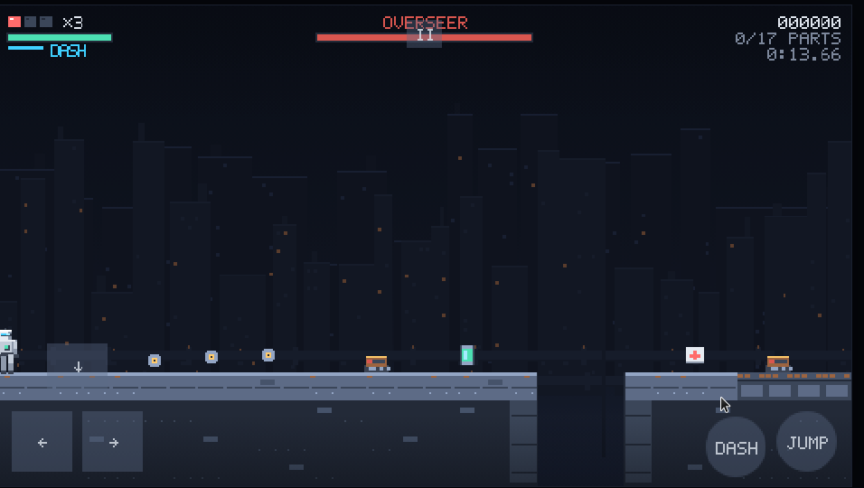

# OPTIMUS — side-scroller

A browser side-scrolling platformer starring **Optimus**, a humanoid factory robot climbing out of a
decaying robotics plant. Built from scratch with TypeScript and Canvas2D: **no game engine and no
binary assets** — every sprite, tile, sound and skyline is generated in code.

Four sectors, a jetpack, a dash, and a gantry crane at the end that would rather you stayed.



|                                                           |                                                            |
| --------------------------------------------------------- | ---------------------------------------------------------- |
|  |  |
|                 |  |

## Quick start

```bash
npm install
npm run dev      # http://127.0.0.1:5173
```

## Controls

| Action               | Keys                                     | Touch                  |
| -------------------- | ---------------------------------------- | ---------------------- |
| Move                 | `←` `→` or `A` `D`                       | on-screen d-pad        |
| Jump                 | `Space` (tap = low hop, hold = high)     | `JUMP`                 |
| **Jetpack**          | press jump again in mid-air **and hold** | hold `JUMP` in mid-air |
| Dash                 | `Shift` or `J`                           | `DASH`                 |
| Drop through catwalk | hold `↓`                                 | `↓`                    |
| Pause / back         | `Esc`                                    | `II`                   |
| Restart level        | `R`                                      | —                      |
| Mute                 | `M`                                      | settings               |
| Debug overlay        | `F3`                                     | —                      |

An alternative `Z` / `X` layout is available in **Settings → Key layout**.

### How it plays

- **Energy** (the green bar) powers the jetpack and the dash, and only refills with both feet on the
  ground. Hovering is a resource, not a mode.
- **Stomp** walkers and drones from above. Turrets and hydraulic presses cannot be stomped — turrets
  are bolted to ledges and fire aimed bolts, presses telegraph before they slam.
- **Checkpoints** cost nothing; dying costs a chassis (you get three per attempt).
- **Parts** are score. Most sit on catwalks a plain jump cannot reach — that is what the jetpack is for.
- Finish under **par** for a time bonus. Best times and scores are saved locally.

### URL parameters

| Parameter        | Effect                                                                          |
| ---------------- | ------------------------------------------------------------------------------- |
| `?level=level-2` | start a specific level (`level-1`…`level-4`, or `dev` for the movement sandbox) |
| `?autoplay=1`    | hand the controls to the autopilot (attract mode / demo recording)              |
| `?touch=1`       | force the on-screen touch controls                                              |
| `?seed=1234`     | pin the world RNG seed                                                          |
| `?test=1`        | expose the deterministic `window.__optimus` test hooks in a production build    |

## Scripts

| Script                  | What it does                                            |
| ----------------------- | ------------------------------------------------------- |
| `npm run dev`           | Vite dev server with hot reload                         |
| `npm run build`         | production bundle into `dist/`                          |
| `npm run preview`       | serve the production bundle on :4173                    |
| `npm run lint`          | type-aware ESLint over the whole repo                   |
| `npm run typecheck`     | `tsc --noEmit`, strict                                  |
| `npm test`              | Vitest unit suite (325 tests)                           |
| `npm run test:coverage` | unit suite with coverage thresholds                     |
| `npm run test:e2e`      | Playwright browser smoke tests against the built bundle |
| `npm run levels`        | print every level with rulers and a layout audit        |
| `npm run bench`         | frame-time bench across resolutions/quality (see below) |
| `npm run ci`            | lint + typecheck + unit + build + e2e (what CI runs)    |

## Design notes

**Fixed 480×270 internal buffer**, integer-upscaled to the viewport. Crisp pixels, cheap fill-rate,
and gameplay code never deals with real window sizes (`src/core/canvas.ts`).

**Fixed-timestep simulation** at 1/60 s with an accumulator and render interpolation. `advance()` and
`stepFrames()` are wall-clock free, so tests and the browser harness drive the game frame-exactly
(`src/core/loop.ts`).

**Determinism first.** Every random decision flows through a seeded PRNG owned by the world, so the
same seed plus the same input tape reproduces a run exactly — that is what makes gameplay testable.
The browser and headless runs agree to the millisecond: the autopilot clears level 1 in `0:10.65`
either way.

**Simulation is pure; rendering is a read-only view.** Nothing in `src/render/` mutates game state,
and nothing in `src/game/` touches the DOM. The whole game — menus, saves, boss fight — runs headless
in Node.

**Movement feel is explicit, not emergent.** Coyote time, jump buffering, variable jump height with a
minimum hop, apex hang, a cooldown dash, and a jetpack that defers to the jump buffer when you are
about to land. Every number lives in `src/game/constants.ts`.

**Everything is drawn from code.** Tiles pick their edges from neighbours, the skyline is generated
from the level seed, sprites are assembled from rectangles per frame, the font is a 5×7 bitmap, and
the audio is oscillators and noise bursts with a scheduled arpeggio for music.

## Project layout

```
src/core/     engine primitives: canvas, loop, input, touch, audio, rng, math, storage
src/game/     simulation: tilemap, physics, player, enemies, levels, world, scenes, game, autopilot
src/render/   drawing: Classic Canvas2D + WebGL2 (`gl/`) backends behind `WorldView`
scripts/      developer tools (level report / layout audit)
tests/unit/   Vitest specs for the pure modules
tests/e2e/    Playwright smoke tests against the built bundle
```

### Renderer backends (4K visual overhaul — in progress)

- **WebGL2** is preferred when available (`?renderer=auto`, the default). Stage 1 presents the
  Classic painter through a GL blit so the device/program/texture path is live; later stages replace
  that with deferred lighting, materials, skeletal sprites and post-processing.
- **Classic** Canvas2D remains a full fallback (`?classic=1` or `?renderer=classic`) so the game
  never fails to boot without WebGL2.
- **F3** debug overlay reports the active backend and quality preset; **F4** cycles quality
  (`low`/`medium`/`high`/`ultra`). Render settings live in `localStorage` key `optimus.render.v1`.
- Reduced motion forces bloom/grain/chromatic aberration/motion blur off.
- **Post-processing** (`src/render/gl/post/`): dual-filter Kawase bloom on thresholded emissives,
  ACES or AgX tonemapping (`settings.tonemap`), vignette, filmic grain, and a slight chromatic
  aberration at the frame edges, plus dither to hide banding. Each effect is toggleable in
  `RenderSettings`; low quality skips bloom/grain/CA, and reduced motion turns all of them off.
- **GPU particles** (`src/render/gl/particleBatch.ts`): instanced, soft-edged quads drawn in two
  additive/alpha passes after lighting, sized for thousands of live particles without per-frame
  allocation.
- **Frame-time bench** (`npm run bench`, [`docs/bench/`](docs/bench/README.md)): a headless
  Playwright pass through level 1 at 1080p/1440p/4K and three quality presets, reporting
  p50/p95/p99 frame times.

Handy URLs: `?classic=1`, `?renderer=webgl2`, `?level=level-4`, `?autoplay=1`.

## Authoring a level

Levels are ASCII in TypeScript source (`src/game/levels/`). The parser validates them and the audit
derives the movement limits from the tuning constants, so an unjumpable pit fails the test suite
rather than the player.

```
#  solid          =  one-way catwalk     ^  spikes        < >  conveyor belts
C  checkpoint     G  goal / hatch        :  scenery       .    empty
P  spawn (exactly one, needs head room)
w  walker         d  drone               t  turret        x  press      B  Overseer (boss)
e  energy cell    o  bolt                k  repair kit
```

```ts
export const LEVEL_5: LevelDef = {
  id: 'level-5',
  name: 'COOLANT LOOP',
  subtitle: 'MIND THE GAP',
  parTimeSec: 45,
  seed: 0xc001,
  rows: ['..............', '..P........G..', '######...#####'],
};
```

Add it to `LEVELS` in `src/game/levels/index.ts`, then:

```bash
npm run levels     # rulers + gap/step/entity audit
npm test           # includes "every campaign level is completable" (played by the autopilot)
```

The **autopilot** (`src/game/autopilot.ts`) is a greedy platforming AI that reads the tiles ahead and
plays the game through the normal input interface. It runs the title-screen attract mode, powers
`?autoplay=1`, and proves in CI that every level — including the boss — can actually be finished.

## Testing

- **325 unit tests** over the pure modules: physics (tunnelling, one-way platforms, corners), the
  player state machine driven by frame-exact input tapes, enemies, the boss phase machine, level
  parsing/auditing, scene transitions, save migration, audio synthesis, touch input, and simulation
  performance budgets.
- **7 Playwright tests** against the production build: boot without console errors, integer canvas
  scaling and resize behaviour, attract mode, real keyboard input, pause/resume, a deterministic
  autopilot playthrough, save persistence across reload, and touch controls.
- A **fuzz test** hammers 2000 frames of random input at the player, and a **determinism test**
  asserts that identical inputs produce byte-identical state.

## Accessibility

- **Reduced motion** removes screen shake, flashes and the damage vignette.
- **High contrast** brightens terrain and Optimus, darkens the backdrop and saturates hazards.
- Pickups differ in **shape** as well as colour (canister, hex nut, cross).
- Alternative **key layout** (`Z`/`X`) for players who cannot comfortably reach space/shift.
- On-screen **touch controls** with multi-touch support on phones and tablets.

## Licence

MIT — see [LICENSE](./LICENSE).
